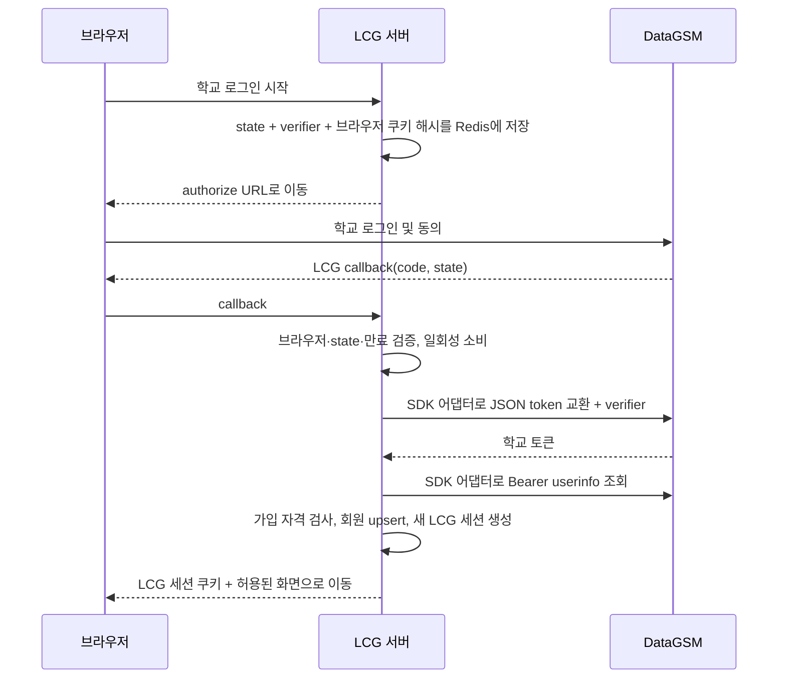

# 학교 OAuth·회원·프로필

## SDK 연동 방향

Kotlin + Spring Boot에서 [DataGSM 공식 Java/Kotlin SDK](https://github.com/themoment-team/datagsm-oauth-sdk-java)를 사용한다. 외부 호출은 Auth 모듈의 어댑터로 감싸 SDK 타입·예외를 LCG 내부 계약으로 변환한다. SDK 업데이트 영향은 이 경계에서 관리하고, 아래 HTTP 명세는 SDK 동작을 검증하는 기준으로 유지한다.

`AUTH-01`에서 채택 버전의 JDK/Spring Boot 호환성, PKCE 지원, JSON 토큰 교환, 사용자 응답 필드와 오류 처리를 확인한다. 필요한 계약이 SDK에 없거나 맞지 않으면 그 차이와 어댑터 보완 범위를 기록한다. SDK 사용만으로 브라우저·state 연결 검증, 일회성 소비, 가입 자격 검사, LCG 세션·권한 처리가 완료된 것으로 보지 않는다.

## DataGSM 공식 문서에서 확인한 계약

확인일: 2026-09-21. 아래 외부 계약과 LCG 자체 설계 제안을 구분한다. 실제 클라이언트 발급·로그인 테스트는 아직 수행하지 않았다.

| 용도 | 외부 요청 | 근거 |
| --- | --- | --- |
| 인증 시작 | `GET https://oauth.authorization.datagsm.kr/v1/oauth/authorize` | [인증 흐름 시작](https://docs.datagsm.kr/oauth/http/authorize) |
| 코드 교환 | `POST https://oauth.authorization.datagsm.kr/v1/oauth/token`, JSON | [토큰 교환](https://docs.datagsm.kr/oauth/http/token-exchange) |
| 토큰 갱신 | 같은 token 경로, JSON, `grant_type=refresh_token` | [토큰 갱신](https://docs.datagsm.kr/oauth/http/token-refresh) |
| 사용자 조회 | `GET https://oauth.resource.datagsm.kr/userinfo`, Bearer 인증 | [사용자 데이터 조회](https://docs.datagsm.kr/oauth/http/userinfo) |

- 인증 시작에는 `client_id`, 등록된 `redirect_uri`를 사용한다. LCG는 `response_type=code`, `state`, `code_challenge`, `code_challenge_method=S256`도 항상 보낸다.
- 사용자 조회 권한은 `datagsm:self_read`다. 문서는 scope 생략을 권장하며 생략 시 등록된 권한 전체가 적용된다. **LCG 제안:** 클라이언트를 최소 권한으로 등록하고, 요청에도 이 scope를 명시해 불필요한 권한 확대를 방지한다. [인증 파라미터](https://docs.datagsm.kr/oauth/http/authorize)
- PKCE 코드 교환 JSON 필드: `grant_type=authorization_code`, `code`, `client_id`, `redirect_uri`, `code_verifier`. SDK가 이 JSON 계약으로 교환하는지 검증한다. Spring의 일반 OAuth 클라이언트를 함께 사용할 경우에도 DataGSM의 JSON 교환 계약을 별도로 확인한다. [교환 요청](https://docs.datagsm.kr/oauth/http/token-exchange)
- PKCE verifier는 43~128자 난수이며 challenge는 SHA-256 결과의 Base64URL이다. LCG는 verifier와 state를 서버의 Redis에 보관한다. [PKCE 가이드](https://docs.datagsm.kr/oauth/pkce)
- 문서상 코드 유효기간은 5분, access token은 1시간, refresh token은 30일이다. 현재 구현은 응답의 `expires_in`이 양수인지 검사하고 userinfo 조회 후 토큰을 보관하지 않는다. LCG 세션 만료는 별도로 관리한다. [OAuth 개요](https://docs.datagsm.kr/oauth)
- 갱신 JSON은 `grant_type=refresh_token`, `refresh_token`, `client_id`가 필수이고 `client_secret`은 선택이다. 응답의 새 access/refresh token 쌍을 함께 교체한다. [갱신 계약](https://docs.datagsm.kr/oauth/http/token-refresh)

### 사용자 매핑

| 외부 필드 | LCG 해석 |
| --- | --- |
| 최상위 `id` | `SchoolIdentity.providerUserId`; `student.id`나 이메일과 혼동하지 않음 |
| `status`, `objectType` | 계정 활성 상태와 STUDENT/TEACHER/null 구분 |
| `student.grade` | 검증된 학년; 사용자 수정 입력을 신뢰하지 않음 |
| `student.role`, `student.isLeaveSchool` | 재학생 자격 판정에 활용 |
| 최상위 `role` | DataGSM 내부 역할이며 LCG 관리자 권한과 무관 |

`isStudent`는 deprecated다. 신규 연동은 `objectType`과 nullable `student`를 검사한다. 학생 역할에는 졸업·자퇴 구분도 있으므로 학생 객체 존재만으로 재학을 판단하지 않는다. [userinfo 명세](https://docs.datagsm.kr/oauth/http/userinfo)

LCG는 재학생만 허용하며, 학교 이메일 도메인 문자열만으로 회원 자격을 판정하지 않는다. `USER-01`에서는 본인 프로필에 표시할 목적의 `학번 이름`만 보관하고 로그인 때 DataGSM 값으로 갱신한다. 이메일·성별·기숙사와 전체 원본 userinfo는 저장/노출하지 않는다. 다른 회원에게 이 이름을 공개하는 정책은 `USER-02`에서 정한다.

## 구현한 로그인 흐름

학교 access token을 LCG API의 사용자 토큰으로 받지 않는다. LCG는 서버가 조회한 userinfo를 바탕으로 자체 세션을 발급한다. 학교 토큰을 프론트 URL이나 브라우저 저장소에 전달하지 않는다. OIDC discovery, ID token, JWKS 지원은 확인하지 않았으므로 존재한다고 가정하지 않는다.

## 구현 현황 (2026-09-22)

- 공식 SDK `com.github.themoment-team:datagsm-oauth-sdk-java:1.6.0`을 JitPack에서 사용한다. 저장소 조회는 해당 모듈로 제한했다. JDK 21·Spring Boot 4.1.1에서 컴파일과 모의 HTTP 계약을 검증했다.
- SDK는 PKCE S256, JSON 코드 교환, Bearer userinfo와 현재 `objectType`을 지원한다. 생성자는 secret을 요구하지만 PKCE 교환 본문에는 보내지 않는다. SDK 예외 본문은 폐기하고 LCG 오류 코드로 변환한다. 연결 2초·읽기 3초·전체 호출 5초, 자동 재시도와 외부 리다이렉트는 해제했다.
- `AUTH-01`은 부분 완료다. 설정·어댑터·계약 테스트는 구현했고, 실제 개발/운영 클라이언트 발급·callback 등록·학교 계정 브라우저 검증은 남아 있다. 활성화 시 필수 설정을 검사하며, 기본 비활성 상태에서는 로그인 시작을 503으로 거부한다.
- `AUTH-02~05`의 서버 구현·자동 검증을 완료했다. state별 5분짜리 HttpOnly 상관 쿠키와 Redis 기록을 만들고, Lua로 브라우저 확인·일회성 소비를 원자적으로 처리한다. 여러 탭은 독립된 쿠키를 사용한다. 로그인 후 이동은 `LOGIN_SUCCESS_URI` 한 곳으로 고정해 `returnUrl` 입력을 받지 않는다.
- 사용자 확인에 따라 ACTIVE 재학생만 허용한다. `objectType=STUDENT`, 학년 1~3, `GENERAL_STUDENT`/`STUDENT_COUNCIL`/`DORMITORY_MANAGER`, 명시적인 `isLeaveSchool=false`를 모두 요구한다. 누락·새로운 알 수 없는 역할은 허용하지 않는다.
- 회원 생성은 최상위 DataGSM ID로 식별하고 DB 트랜잭션의 provider별 advisory lock과 고유키로 동시 최초 가입을 직렬화한다. 로그인 때 학년·자격·검증 시각을 갱신한다. 자격 상실을 확인하면 기존 세션 버전도 무효화한다.
- LCG 세션은 Spring Session Redis에 저장한다. 로그인 때 이전 세션·CSRF를 버리고 새 세션을 발급한다. 매 인증 요청에서 DB 상태·역할·세션 버전·학교 자격을 검사한다. 유휴 30분, 로그인/학교 검증 후 최대 8시간을 적용한다. 정지·탈퇴 상태는 거부하며 전체 로그아웃은 기존 버전의 모든 세션을 다음 요청부터 차단한다. Redis 잔여 세션 데이터는 TTL로 제거한다.
- `GET /api/v1/me`는 회원 UUID·LCG 역할·검증 학년, DataGSM에서 갱신한 `학번 이름`, Riot ID·포지션·소개를 반환한다. 이메일·성별·기숙사와 전체 원본 userinfo, 토큰은 보관하거나 반환하지 않는다. 프로필 값은 현재 회원 본인만 조회할 수 있고 공개 API는 `USER-02`에서 추가한다.
- `AUTH-06`은 현재 범위에서 제외했다. 학교 토큰을 장기 보관하거나 갱신하지 않고, 자격 확인 기한이 지나면 새 학교 로그인을 요구한다.

자동 검증: API 계약 16개, DataGSM SDK 계약 18개, 기반 통합 7개, 인증·프로필 통합 14개 등 55개와 JAR 빌드가 통과했다. 정상/동시 최초 가입, 여러 탭, 다른 브라우저·만료·재사용 state, 가입 불가, 코드 거절·외부 장애·타임아웃, CSRF·세션 교체·현재/전체 로그아웃, 정지·학교 자격 상실·학년·학번 이름 변경, Riot ID·포지션·소개 수정, V1 데이터의 V3 업그레이드를 확인했다. 커버리지 비율은 측정하지 않았다.

설정과 프론트 호출 방법은 [루트 README](../README.md#datagsm-로그인-실행)를 따른다. 운영 프록시·접근 로그에서도 callback query, 쿠키, Authorization 헤더가 기록되지 않도록 설정해야 하며 이 배포 검증은 `OPS-01~02`에 남긴다.

## TODO

- [ ] **AUTH-01 | P0 | OAuth 클라이언트·SDK·설정 준비** — 선행: `FND-01~02`.
  - 구현: [클라이언트 관리](https://www.datagsm.kr/clients)에서 환경별 client 등록, callback URI·최소 scope, 설정 검증, secret 사용 여부를 정한다. SDK 버전·배포 저장소·호환성을 확인하고 Auth 어댑터와 모의 HTTP 서버를 통한 계약 검증 구성을 준비한다. 비밀값은 환경 설정으로 주입한다.
  - 완료 기준: 개발/운영 callback이 정확히 등록되고 설정 문서에는 변수명과 예시만 남는다. SDK의 PKCE·JSON 교환·userinfo 계약과 필요한 보완 사항이 식별된다. 외부 자격 증명 없이도 모의 서버로 다음 구현을 진행할 수 있다.

- [x] **AUTH-02 | P0 | 서버 측 PKCE 인증 시작** — 선행: `AUTH-01`의 SDK/설정, `FND-04~05`의 인증 기반. 실제 클라이언트 검증은 `AUTH-01`에 남김.
  - 구현: state·verifier 생성, 브라우저에 묶인 상관 쿠키와 서버 저장소, 인증 시작 TTL, 서버 설정에 고정한 성공 이동 주소를 구현한다. 여러 탭의 로그인 시도는 서로 분리한다.
  - 완료 기준: 임의 외부 URL로 리다이렉트되지 않으며 다른 브라우저의 state를 사용할 수 없다. challenge 생성이 PKCE 규격과 일치한다.

- [x] **AUTH-03 | P0 | 콜백·토큰 교환·학교 회원 upsert** — 선행: `AUTH-02`, `FND-03`의 회원 스키마·트랜잭션.
  - 구현: state/상관 쿠키 확인 및 원자적 일회성 소비 → SDK 어댑터를 통한 JSON 코드 교환·userinfo 조회 → 자격 검사 → User/SchoolIdentity 생성·갱신을 수행한다. 이메일 변경에도 최상위 provider ID로 같은 회원을 찾는다.
  - 완료 기준: 동일 회원 동시 로그인에도 하나의 User만 존재한다. 누락·만료·재사용 code/state, 거절·타임아웃·userinfo null/비학생·졸업/자퇴 등에서 세션을 잘못 발급하지 않는다.

- [x] **AUTH-04 | P0 | LCG 세션·로그아웃·권한** — 선행: `AUTH-03`.
  - 구현: Spring Security 기반으로 로그인 시 세션 ID 교체, HttpOnly/Secure/SameSite 쿠키, CSRF 방어, 세션 만료, `GET /me`, 현재/전체 세션 종료, 정지·탈퇴 시 즉시 무효화를 구현한다. LCG 운영자 부여는 별도 통제한다.
  - 완료 기준: 로그아웃 후 쿠키 재사용이 실패한다. DB 사용자 상태 변경이 기존 세션에도 적용된다. LCG 로그아웃을 학교 전체 로그아웃으로 표시하지 않는다.

- [x] **AUTH-05 | P0 | 인증 실패·학교 자격 재검증 정책** — 선행: `AUTH-03~04`.
  - 구현: 외부 장애와 가입 불가를 별도 오류로 매핑한다. 로그인 때 학교 정보를 갱신하고 세션/자격 검사 유효기간을 제한한다. 마지막 확인 시각 이후 자격이 오래된 계정은 재인증을 요구한다.
  - 완료 기준: 학년·재학 상태 변경이 다음 확인에서 반영된다. 학교 장애 시 새 회원 검증을 건너뛰지 않으며 토큰·code·원본 userinfo가 로그에 남지 않는다.

- [ ] **AUTH-06 | P1·조건부 | 학교 토큰 갱신과 안전한 보관** — 선행: `AUTH-04~05`; 지속적인 학교 정보 조회를 선택한 경우.
  - 상태: **현재 범위 제외**. 로그인 때만 학교 정보를 읽고 토큰을 폐기하는 방식을 채택했으므로 장기 보관·갱신은 구현하지 않는다.
  - 구현: 기본안은 로그인 때만 학교 정보를 읽고 외부 토큰을 장기 보관하지 않는 것이다. 백그라운드 재검증을 선택한다면 복호화 가능한 암호화 보관, 단일 갱신, 새 토큰 쌍 원자적 교체·폐기·실패 시 재로그인을 구현한다.
  - 완료 기준: 동시 갱신으로 최신 토큰을 덮어쓰지 않는다. 학교 토큰 갱신과 LCG 세션 연장은 별도다. 미채택 시 이유를 기록하고 범위에서 제외 처리한다.

- [x] **USER-01 | P1 | 내 프로필 조회·수정** — 선행: `AUTH-04`, `FND-03~05`.
  - 구현: DataGSM `studentNumber`·`name`으로 만든 `학번 이름`을 로그인마다 갱신하고, Riot ID(`gameName#tagLine`)·주/부 포지션·자기소개를 `user_profiles`에 저장한다. `GET/PATCH /api/v1/me`은 현재 세션 회원만 처리한다. Riot ID는 형식만 확인하며, 아직 Riot API로 계정 소유나 중복을 검증하지 않는다.
  - 완료 기준: 수정 요청에 학교 이름·학번·회원 ID를 받지 않아 타인의 정보나 학교 정보를 바꿀 수 없다. 보조 포지션은 주 포지션이 있을 때만 서로 다르게 설정되고, CSRF 없는 수정은 거부된다. V3 마이그레이션은 기존 회원의 빈 프로필도 생성한다.

- [ ] **USER-02 | P1 | 공개 설정과 공개 프로필 DTO** — 선행: `USER-01`.
  - 구현: `D-05`의 필드별 공개·랭킹/통계 참여 정책, 소유자/다른 회원 응답 분리, 공개 설정 변경 이벤트와 캐시 제거를 구현한다.
  - 완료 기준: 비공개 학년·Riot 연결·랭크·전적이 프로필 외의 홈·작성자 배지·랭킹에서도 노출되지 않는다. 통계 동의는 내전 결과 동의와 구분한다.

- [ ] **USER-03 | P1 | 게임 정보가 연결된 프로필** — 선행: `USER-02`, `RIOT-03`, `MAT-01~03`.
  - 구현: Solo/Flex 랭크, 숙련도 기반 모스트, 최근 전적, 계정 검증 상태, 갱신 시각을 조합한다. 최근 전적 기반 모스트와 숙련도 순위는 라벨을 구분한다.
  - 완료 기준: 미등록·미인증·언랭크·오래된 데이터 상태를 표현하고 외부 API 장애 때문에 프로필 전체가 실패하지 않는다.

- [ ] **USER-04 | P1 | 탈퇴·연결 해제·데이터 정리** — 선행: `USER-02`, `RIOT-03`, `COM-01`.
  - 구현: 계정 비활성화, 세션 폐기, 학교/Riot 연결과 공개 캐시 제거, 게시물 익명화 또는 삭제 정책을 구현한다. 이후 추가되는 참가·알림·통계에도 정리 처리를 확장한다.
  - 완료 기준: 탈퇴 계정이 검색/랭킹에 계속 표시되지 않으며 재가입·보존·삭제 정책이 정해진다. 외부 API로 이미 공개된 전적 삭제까지 보장한다고 안내하지 않는다.

## LCG API

구현 완료: `GET /api/v1/auth/school/login`, `GET /api/v1/auth/school/callback`, `GET /api/v1/auth/csrf`, `POST /api/v1/auth/logout`, `POST /api/v1/auth/logout-all`, `GET/PATCH /api/v1/me`. 변경 요청은 세션 및 CSRF 검증을 거친다. callback은 기존 LCG 로그인을 요구하지 않고 OAuth 상관 검증을 사용한다.

후속 초안: `DELETE /api/v1/me`, `PATCH /api/v1/me/privacy`, `GET /api/v1/users/{userId}`.
